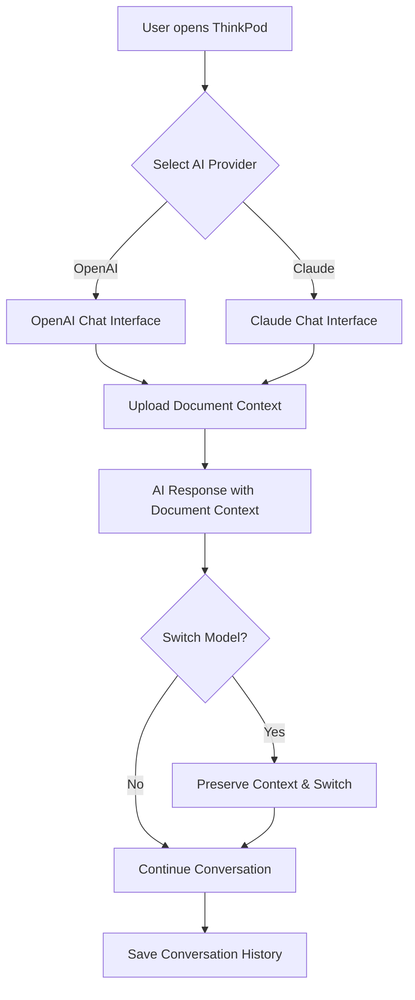
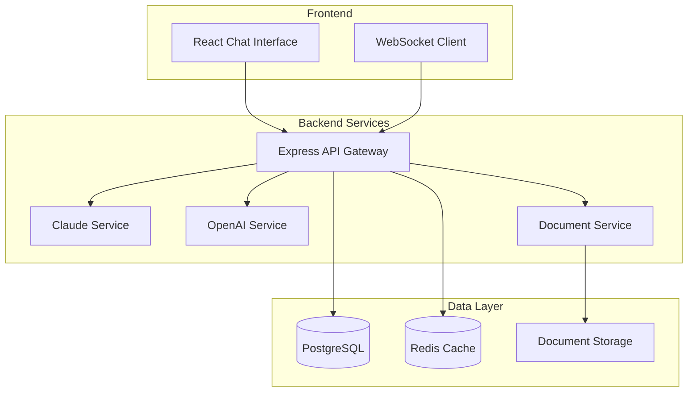
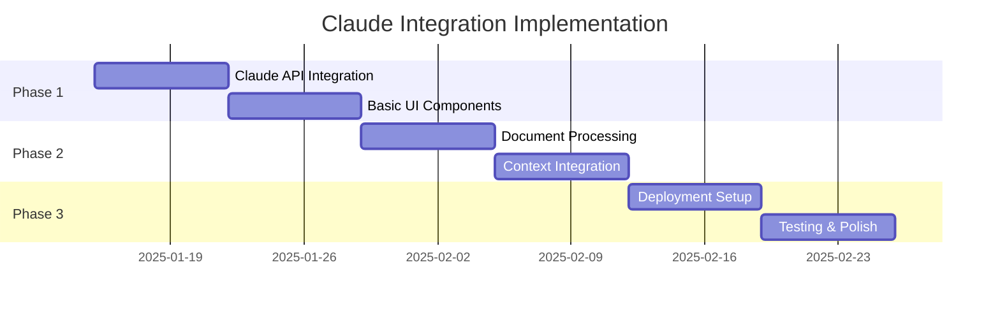

# Product Requirements Document: Claude Integration Web Interface for ThinkPod

## 1. Executive Summary

### Problem Statement
ThinkPod currently integrates with OpenAI for LLM capabilities but lacks Claude AI access, limiting AI model diversity and creating vendor lock-in risk. The user requires a personal, low-maintenance solution to integrate Claude AI with existing document processing capabilities.

### Proposed Solution
Implement a lightweight Claude AI integration into ThinkPod's existing web interface, providing seamless model switching between OpenAI and Claude with document context preservation. Focus on simplicity, reliability, and minimal operational overhead.

### Success Criteria
- Personal satisfaction with multi-model AI experience
- Stable operation with minimal maintenance requirements
- Successful document context integration with Claude
- Easy deployment and updates through existing ArgoCD pipeline

### Resource Requirements
- Single developer (self-implementation)
- Zero budget (use existing API credits)
- Leverage existing Kubernetes/ArgoCD infrastructure
- Minimal ongoing maintenance effort

## 2. Market Analysis

### Market Opportunity
The AI integration platform market shows explosive growth (29% CAGR) with a $5-10B opportunity by 2027. However, for personal use, the focus shifts to:
- **Vendor Diversification**: Avoiding OpenAI lock-in
- **Model Specialization**: Claude excels at analysis, reasoning, and long-form content
- **Cost Optimization**: Claude's 200K context window reduces chunking complexity
- **Future-Proofing**: Multi-provider architecture enables rapid model adoption

### Competitive Landscape
Personal AI aggregators like Poe ($10-20/month) and ChatHub provide multi-model access but lack:
- Document integration capabilities
- Self-hosted deployment options
- Deep customization for personal workflows
- Integration with existing productivity systems

### User Segments
**Primary User**: Single power user (self) requiring:
- Sophisticated AI model access for research and analysis
- Document-aware conversations
- Low-maintenance, reliable operation
- Integration with existing homelab infrastructure

## 3. User Experience Design

### User Personas and Journeys

**Primary Persona: Technical Researcher/Developer**
- **Goals**: Access best AI model for specific tasks, analyze documents with AI, maintain privacy and control
- **Pain Points**: Vendor lock-in, context loss between platforms, subscription fatigue
- **Usage Patterns**: Daily AI use for research, document analysis, code assistance

### Key User Flows



### Wireframes and Interface Design

**Model Selection Interface:**
- Prominent toggle/dropdown for OpenAI ↔ Claude switching
- Visual indicators for model capabilities and context limits
- Current conversation context preservation status

**Document Integration UX:**
- Drag-and-drop document upload with progress indicators
- Document context snippet display in conversation
- Clear indication of document processing status

## 4. Technical Architecture

### System Architecture



### Technology Stack

**Frontend:**
- React 18 with Next.js 14 (SSR for better performance)
- TypeScript for type safety
- TailwindCSS for minimal styling overhead
- WebSocket/SSE for real-time streaming

**Backend:**
- Node.js with Express (JavaScript ecosystem alignment)
- TypeScript for consistency
- Anthropic SDK for Claude integration
- OpenAI SDK for existing functionality

**Database:**
- PostgreSQL (existing infrastructure)
- Redis for conversation caching
- File system storage for documents

**Infrastructure:**
- Docker containers for consistent deployment
- Kubernetes deployment via ArgoCD
- Rackspace Spot instances (existing setup)

### Integration Points

**Claude API Integration:**
```typescript
interface ClaudeService {
  chat(messages: Message[], context?: DocumentContext): Promise<StreamResponse>;
  validateKey(): Promise<boolean>;
  getModels(): Promise<ClaudeModel[]>;
}
```

**Provider Abstraction:**
```typescript
interface AIProvider {
  type: 'openai' | 'claude';
  chat(params: ChatParams): Promise<Response>;
  stream(params: ChatParams): AsyncIterable<Chunk>;
}
```

### Scalability Considerations
- **Single User Focus**: Optimize for personal use, not horizontal scaling
- **Stateless Design**: Enable easy container restarts and updates
- **Efficient Caching**: Minimize API calls through intelligent caching
- **Resource Limits**: Implement soft limits to prevent runaway costs

## 5. Security & Compliance

### Security Requirements
- **API Key Security**: Environment variable storage, never in code
- **Local Data Control**: All conversations and documents stored locally
- **Minimal External Dependencies**: Reduce attack surface
- **Regular Updates**: Security patches through automated container rebuilds

### Data Privacy
- **No External Logging**: All data remains in personal infrastructure
- **Document Privacy**: Documents processed locally before AI submission
- **Conversation History**: Encrypted storage with user-controlled retention
- **API Isolation**: Separate API keys for different environments

### Risk Assessment
- **Low Risk Profile**: Single user, personal use
- **API Dependency**: Mitigation through multi-provider architecture
- **Cost Control**: Usage monitoring and automatic limits
- **Maintenance Risk**: Simple architecture reduces complexity

## 6. Implementation Plan

### Phase 1: Core Integration (Weeks 1-2)
**MVP Goals:**
- [ ] Claude SDK integration and basic API wrapper
- [ ] Simple model selection UI component
- [ ] Database schema updates for provider tracking
- [ ] Basic conversation routing (OpenAI vs Claude)

**Deliverables:**
- Working Claude chat interface
- Model switching capability
- Conversation persistence

### Phase 2: Document Integration (Weeks 3-4)
**MVP Goals:**
- [ ] Document upload and processing pipeline
- [ ] Context injection for Claude conversations
- [ ] Document storage and retrieval system
- [ ] Basic document management UI

**Deliverables:**
- Document-aware Claude conversations
- File upload and processing
- Context preservation across models

### Phase 3: Polish & Deployment (Weeks 5-6)
**MVP Goals:**
- [ ] ArgoCD deployment configuration
- [ ] Container optimization for resource efficiency
- [ ] Error handling and logging
- [ ] Basic monitoring and health checks

**Deliverables:**
- Production-ready deployment
- Automated CI/CD pipeline
- Monitoring and alerting

### Implementation Timeline



### Dependencies and Prerequisites
- **Anthropic API Access**: Claude API key and quota
- **Existing Infrastructure**: ThinkPod codebase and deployment pipeline
- **Development Environment**: Local development setup
- **Testing Environment**: Staging deployment for validation

## 7. Success Metrics

### Key Performance Indicators

**Functional Success:**
- Claude integration responds within 2 seconds
- Document processing success rate > 95%
- Zero data loss during model switching
- Successful deployment through ArgoCD pipeline

**Personal Satisfaction Metrics:**
- Daily usage adoption within 1 month
- Preference for Claude over OpenAI for specific tasks
- Successful document analysis workflows
- Reduced friction in AI model selection

**Technical Performance:**
- Memory usage < 512MB per container
- CPU usage < 1 core average
- Storage growth < 1GB per month
- Uptime > 99% (personal infrastructure)

### Acceptance Criteria

**Must Have:**
- [ ] Switch between OpenAI and Claude in same conversation
- [ ] Upload documents and chat about them with Claude
- [ ] Preserve conversation history across restarts
- [ ] Deploy via existing ArgoCD without manual intervention

**Should Have:**
- [ ] Real-time streaming responses
- [ ] Document processing progress indicators
- [ ] Conversation export functionality
- [ ] Basic usage analytics

**Could Have:**
- [ ] Model comparison views
- [ ] Advanced document processing options
- [ ] Conversation templates
- [ ] API usage monitoring dashboard

## 8. Risk Assessment

### Technical Risks and Mitigation

**API Rate Limits**
- *Risk*: Claude API limits blocking usage
- *Mitigation*: Implement graceful degradation, usage monitoring
- *Impact*: Medium | *Probability*: Low

**Integration Complexity**
- *Risk*: Claude API differences causing issues
- *Mitigation*: Comprehensive testing, provider abstraction layer
- *Impact*: High | *Probability*: Medium

**Maintenance Overhead**
- *Risk*: Complex system requiring frequent updates
- *Mitigation*: Simple architecture, minimal dependencies
- *Impact*: High | *Probability*: Low

### Operational Risks

**Infrastructure Costs**
- *Risk*: Increased resource usage
- *Mitigation*: Efficient implementation, resource monitoring
- *Impact*: Low | *Probability*: Low

**API Costs**
- *Risk*: Unexpected high usage
- *Mitigation*: Usage limits, monitoring alerts
- *Impact*: Medium | *Probability*: Low

**Deployment Issues**
- *Risk*: ArgoCD integration problems
- *Mitigation*: Staged rollout, rollback procedures
- *Impact*: Medium | *Probability*: Low

### Success Dependencies

**Critical Success Factors:**
- Anthropic API stability and availability
- Existing ThinkPod architecture compatibility
- Personal time availability for implementation
- Rackspace infrastructure reliability

**Risk Mitigation Strategy:**
- Start with minimal viable implementation
- Maintain OpenAI fallback for critical workflows
- Document all configuration for easy troubleshooting
- Implement comprehensive logging for debugging

## Implementation Checklist

### Development Environment Setup
- [ ] Fork/branch existing ThinkPod repository
- [ ] Set up local development environment
- [ ] Obtain Claude API key and test access
- [ ] Configure development database schema

### Core Development
- [ ] Implement Claude SDK wrapper service
- [ ] Create provider abstraction layer
- [ ] Build model selection UI components
- [ ] Add conversation routing logic
- [ ] Implement document processing pipeline
- [ ] Create document context injection system

### Testing and Validation
- [ ] Unit tests for Claude integration
- [ ] Integration tests for document processing
- [ ] End-to-end testing of complete workflow
- [ ] Performance testing under typical usage

### Deployment Preparation
- [ ] Create Docker containers for new services
- [ ] Configure Kubernetes manifests
- [ ] Set up ArgoCD application definition
- [ ] Prepare environment variable configuration
- [ ] Create monitoring and logging setup

### Production Deployment
- [ ] Deploy to staging environment
- [ ] Validate complete functionality
- [ ] Deploy to production via ArgoCD
- [ ] Monitor initial usage and performance
- [ ] Document operational procedures

This PRD provides a comprehensive roadmap for implementing Claude integration into ThinkPod, optimized for personal use, minimal maintenance, and seamless integration with existing infrastructure. The focus on simplicity and reliability ensures long-term sustainability while providing access to state-of-the-art AI capabilities.